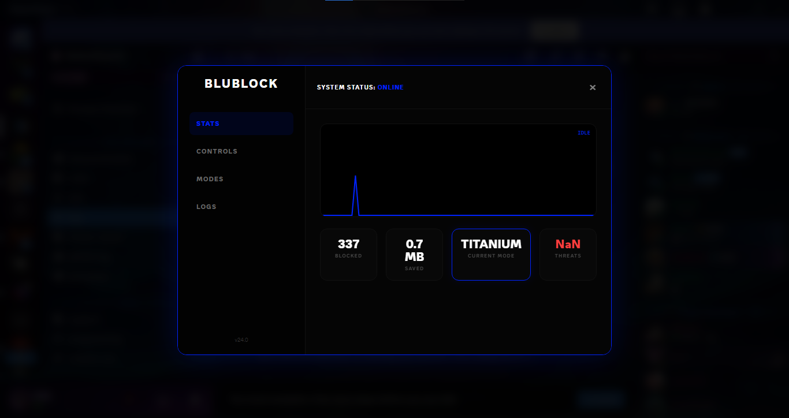

# BluBlock 🛡️

**The Ultimate Protection Suite for BetterDiscord.**

Let's be honest—Discord is getting heavy. Between the constant tracking, the "Nitro" popups, and the endless stream of useless assets loading in the background, your client is doing way more work than it needs to. 

I built **BluBlock** to fix that. It’s a dashboard and protection suite that lives right in your header bar, giving you control over what Discord is allowed to load.

## 🚀 Features

*   **Privacy First:** Blocks known telemetry and analytics endpoints. Stop sending your data out.
*   **Anti-Bloat:** Aggressively blocks billing, quests, family center, and promotional assets.
*   **Visual Dashboard:** See exactly what's being blocked in real-time with a live traffic graph.
*   **Resource Saver:** Saves bandwidth and RAM by preventing useless requests.

## 🎚️ Protection Modes

BluBlock comes with 4 presets depending on how much you want to strip down the client:

*   **🟢 BASE:** Minimum protection. Just blocks the creepy tracking stuff.
*   **🔵 NORMAL (Recommended):** The sweet spot. Blocks tracking + the usual bloat (store, gifts, promos).
*   **🟠 STRICT:** For performance junkies. Blocks all the above + typing indicators.
*   **🔴 TITANIUM:** The nuclear option. Blocks embeds, stickers, and almost all media. Text only. Maximum speed.

## 📦 How to Install

1.  Download `BluBlock.plugin.js` from the [Releases](https://github.com/neycooks/BluBlock/releases) page (or the root of this repo).
2.  Open Discord and go to **User Settings > Plugins**.
3.  Click **Open Plugins Folder**.
4.  Drag and drop the file into that folder.
5.  **Done!** You'll see the 🛡️ icon appear in your top header bar.

## 🤝 Contributing

Found a new tracking URL? Have an idea for a mode? Feel free to open an issue or pull request. I'm always looking to make this lighter and faster.

---
*Made with ❤️ (and less RAM) by neycooks*
